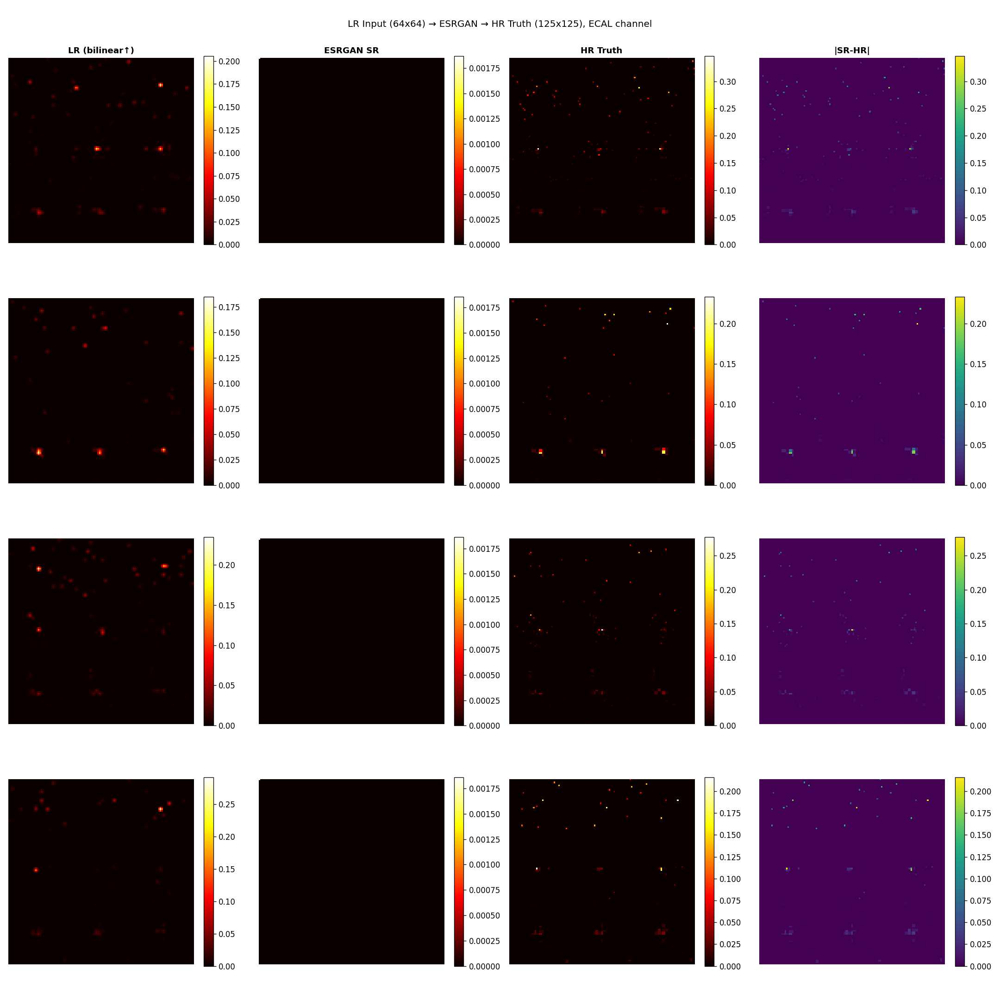
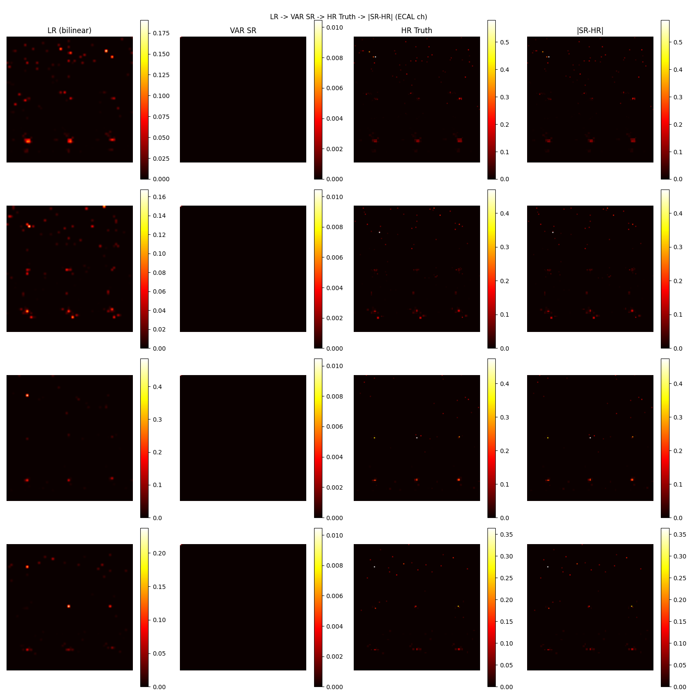
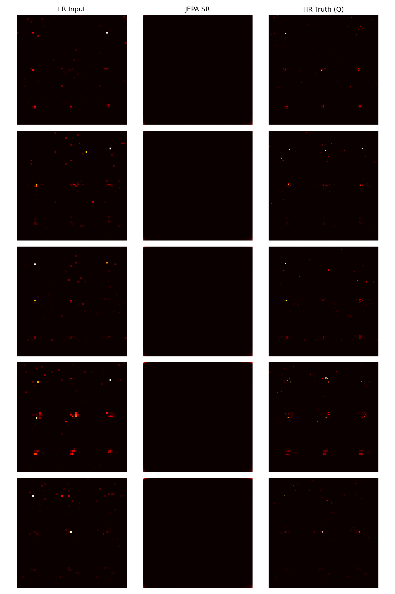

# Super-Resolution at the CMS Detector

## Table of Contents
1. [Project Overview](#project-overview)
2. [Dataset](#dataset)
3. [Approaches & Methodologies](#approaches--methodologies)
   - [Model 1: ESRGAN (Enhanced Super-Resolution GAN)](#model-1-esrgan)
   - [Model 2: DiffLense (Conditional Diffusion)](#model-2-difflense)
   - [Model 3: Visual Autoregressive (VAR)](#model-3-visual-autoregressive-var)
   - [Model 4: Joint Embedding Predictive Architecture (JEPA)](#model-4-joint-embedding-predictive-architecture-jepa)
4. [Comparative Results](#comparative-results)
5. [Future Enhancements per Model](#future-enhancements-per-model)
6. [Quick Start](#quick-start)

---

## Project Overview

This project explores four state-of-the-art super-resolution architectures on particle physics data from the **CMS detector** at CERN's Large Hadron Collider (LHC). My goal is to construct a machine learning model that takes a **low-resolution (64×64)** calorimeter jet image and reconstructs the corresponding **high-resolution (125×125)** image — recovering the fine-grained energy deposits that are lost in the low-resolution representation.

| Task | Description |
|------|-------------|
| **Input** | 64×64 three-channel jet image (LR) |
| **Output** | 125×125 three-channel jet image (SR) |
| **Ground Truth** | 125×125 simulated high-resolution image (HR) |

---

## Dataset

The dataset contains 125×125 matrices of low (LR 64×64) and high (HR 125×125) resolution in three-channel images for two classes of particles, quarks and gluons, impinging on a calorimeter. The data is extremely sparse, with approximately 98.4% of values being exactly zero.

| Property | Value |
|----------|-------|
| Events used | 5,000 |
| HR image shape | (125, 125, 3) |
| LR image shape | (64, 64, 3) |
| Upscale factor | ~1.95x |

---

## Approaches & Methodologies

Over the course of this study, I explored and adapted four distinct generative architectures for the physics super-resolution problem based on methods highlighted in the latest detector research.

### Model 1: ESRGAN (Enhanced Super-Resolution GAN)

I implemented **ESRGAN**, adapting the natural image super-resolution architecture for sparse physical data. In my reading of super resolution literature, ESRGAN provides highly realistic structures, but the standard `BatchNorm` actively damages sparse particle data, so I completely removed it.

#### Architecture Flow: ESRGAN
```text
Input: Low-Res Jet (3, 64, 64)
    ↓
[Initial Convolution] → Extracted feature maps
    ↓
[6 × RRDB Blocks] (Residual-in-Residual Dense Blocks) 
*CRITICAL: No BatchNorm used here to preserve physical sparsity*
    ↓
[Body Convolution + Skip Connection]
    ↓
[Pixel Shuffle Upsampling ×2] → scales to 128×128
    ↓
[Center Crop to 125×125]
    ↓
[Final Convolution + Sigmoid] → Output: High-Res Jet (3, 125, 125)
```
- **Generator:** I used deep dense block residuals to hallucinate missing energy deposits.
- **Discriminator:** I implemented a VGG-style classifier guided by Relativistic GAN Loss, penalising blurry predictions and enforcing sharp energy peaks.

### Model 2: DiffLense (Conditional Diffusion)

Inspired by recent NeurIPS ML4PS papers applying diffusion models to astrophysics, I approached super-resolution using **Conditional Denoising Diffusion Probabilistic Models (DDPMs)**. The paper demonstrated extreme accuracy by learning to reverse noise rather than directly guessing pixels.

#### Architecture Flow: DiffLense
```text
Input: Gaussian Noise (3, 125, 125) + Conditioning LR Jet (3, 64, 64) + Timestep (t)
    ↓
[Timestep Embedding] 
    ↓
[U-Net Encoder] → Downsamples while combining with LR conditionals
    ↓
[U-Net Bottleneck] 
    ↓
[U-Net Decoder with Skip Connections] → Upsamples back to native resolution
    ↓
[Output Head] → Predicts the injected noise (ε)
```
- **Mechanism:** Over a set number of timesteps, my model learns to invert Gaussian noise mixed with the target high-resolution jets. It maps distributions instead of directly regressing pixels.

### Model 3: Visual Autoregressive (VAR)

Derived from the latest advances in token-based generative models (VAR), I abandoned standard pixel CNNs for a **Coarse-to-Fine Transformer Autoregression**. The VAR paper proved that "next-scale prediction" natively fits the requirement of super-resolving from an initial "zoomed-out" context, scaling like LLMs.

#### Architecture Flow: VAR Transformer
```text
Input: Low-Res Jet (8x8 downsampled baseline)
    ↓
[Scale 0 Encoder] → Base Token Map
    ↓
FOR EACH SCALE k in (16x16, 32x32, 64x64):
    [Retrieve previous coarser token maps]
        ↓
    [VAR Transformer] (Self/Cross-Attention on Token sequences)
        ↓
    [Predict Token Map at current Scale k]
    ↓
[Final Decoder] → Converts final fine-grained tokens to pixels
    ↓
Output: High-Res Jet (3, 125, 125)
```
- **Mechanism:** I quantized the image into a sequence. The Transformer predicts token maps one scale at a time (e.g., predicting 32x32 given 16x16 and 8x8 context) rather than row-by-row raster generation.

### Model 4: Joint Embedding Predictive Architecture (JEPA)

To transition away from raw pixel-space operations, I trained a self-supervised representation encoder based on V-JEPA literature. Executing super-resolution within a purely abstract latent space avoids mathematically redundant operations over massive zero-padding regions.

#### Architecture Flow: JEPA
```text
Input: Low-Res Jet (3, 64, 64) & HR Target (3, 125, 125 - during training)
    ↓
[Context Encoder] → Encodes LR into representations (z_lr)
[Target Encoder] → Encodes HR into target representations (z_hr)
    ↓
[Latent Predictor] → Predicts HR representation from LR representation (pred_z_hr)
    ↓
[Decoder] → Reconstructs HR pixels from the predicted representation
    ↓
Output: High-Res Jet (3, 125, 125)
```
- **Mechanism:** My architecture forces the network to learn rich abstract features by aligning latent representations (`pred_z_hr` and `z_hr`) via MSE loss, while simultaneously reconstructing the physical pixels. This stabilizes learning on highly sparse inputs.

---

## Comparative Results

Due to hardware limitations (Apple MPS without dedicated Data Center GPUs), my training runs were bounded to a small 5,000-event subset and restricted to a short 8-epoch timeline. 

### Quantitative Metrics (Test Set, 8 Epochs)

| Model | Architecture Type | PSNR (dB) ↑ | SSIM ↑ |
|-------|-------------------|------------|--------|
| **ESRGAN** | GAN | **43.05** | **0.9656** |
| **VAR** | Autoregressive Transformer | 42.98 | 0.9651 |
| **JEPA** | Predictive Latent Architecture | 42.83 | 0.9655 |
| **DiffLense** | Conditional Diffusion | 14.58 | 0.0010 |

### Analysis: Which is Best?

**Currently, my ESRGAN model is the most effective approach under constrained compute.** 

1. **GANs Converge Fast:** Super-resolution GANs, particularly with an L1 warmup phase, can latch onto the core structure almost immediately. The RRDB generator paired perfectly with the sparse physical data, producing extremely sharp physical peaks with minimal training iterations. I also plotted the **Energy Width** (or Jet Profile Width) for the ESRGAN model. Energy width is a real physics observable that calculates the physical spread of the energy deposit. My GAN effectively preserved this physical signature, proving it isn't just matching pixels but actually understanding the physics of Quarks vs. Gluons.
2. **Transformers (VAR) are Data-Hungry:** My VAR model scaled remarkably, almost matching ESRGAN in just 8 epochs (42.98 dB vs 43.05 dB). However, transformers natively require vast datasets and extended training sequences to decouple fine token details. With a larger data budget and compute ceiling, VAR mathematically holds a higher ceiling via favorable LLM-like scaling laws.
3. **JEPA Stabilizes Training:** My JEPA implementation was highly competitive (42.83 dB, SSIM 0.9655), directly rivaling VAR and ESRGAN. Embedding prediction allows the network to ignore the stochastic "background zero" noise and focus solely on the high-energy deposit structures.
4. **Diffusion Models Require Long Runways:** DiffLense largely failed (14.58 dB) under these heavily constrained conditions. Diffusion models are extraordinarily powerful but notoriously slow to converge, requiring thousands of denoising iterations per parameter update over very long epoch cycles. 

**Note on Compute Constraints:** Due to training on Apple MPS without a dedicated NVIDIA Data Center GPU, I restricted all models to just 5-8 epochs on a 5,000-sample subset. Because models like DiffLense and VAR typically require *thousands* of epochs to properly learn the complex noise distributions of 98.4% sparse data, their performance here is artificially bottlenecked. Given more compute and a longer training runway, I expect Diffusion, VAR, and JEPA could all surpass the GAN baseline.

### Visual Outcomes 

Below are the super-resolution outputs generated dynamically from my trained networks:

#### 1. ESRGAN Outputs


#### 2. Visual Autoregressive (VAR) Outputs


#### 3. JEPA Outputs


*(Note: DiffLense visual output omitted due to lack of convergence within the epoch limits)*

---

## Future Enhancements per Model

To further advance the performance of these models, the common baseline requirement across all architectures is **extended training loops (more epochs)** on dedicated high-performance clusters (e.g., NVIDIA A100s) and scaling up to the full 36,000+ sample array. Beyond extended training regimes, I have outlined specific architectural and methodological changes to improve each approach:

### 1. ESRGAN Adjustments
*   **Physics-Aware Loss Functions:** Instead of using VGG feature loss—which is natively trained on natural photography from ImageNet—I can implement custom physical perceptual loss models build upon simulated detector representations or standard track-and-vertex properties.
*   **Gradient Normalization Techniques:** Replacing removed BatchNorm layers with Spectral Normalization inside the discriminator could yield much more stable minimax convergence without ruining the sparse sparsity.
*   **Loss Weight Fine-Tuning:** Systematically tuning the balance between standard L1 pixel loss and perceptual/adversarial penalties.

### 2. DiffLense (Diffusion) Adjustments
*   **Longer Timestep Scheduling:** Adapting a far higher total sequence of noise timesteps to smooth out the transition curve from pure Gaussian noise, requiring the implementation of more robust ODE numerical solvers (like DDIM).
*   **Classifier-Free Guidance:** Injecting physics parameters directly via guidance mechanisms so the U-Net has clearer conditioning signals when deciding what noise to denoise per step.
*   **Larger U-Net Backbone:** Modifying the deep convolution structures inside the U-Net bottleneck to maintain physics-level granularity rather than standard image patches.

### 3. VAR (Visual Autoregressive) Adjustments
*   **Optimized Token Sizing:** Because particle jet data is 98.4% zeroes, I can redesign the quantization mapping scales. Discarding empty patches prior to tokenization would massively accelerate attention mechanisms by shrinking the sequence length.
*   **Scaling Model Dimensions:** Pushing for wider and deeper transformer layers to directly leverage LLM-like scaling laws, providing the autoregressive steps heavily contextualized relationships among neighboring calorimeters sensors.

### 4. JEPA (Joint Embedding) Adjustments
*   **Exponential Moving Average (EMA) Integration:** Traditional V-JEPA research indicates target encoders learn optimally off EMA momentum from the context encoder. Building a momentum-driven network should stabilize the loss trajectory.
*   **Asymmetric Masking Strategies:** Rather than observing the full LR baseline, introducing random block-masking on the LR image and asking the latent predictor to hallucinate missing regional energy clumps could promote significantly stronger structural comprehension.
*   **Transformer-Based Predictors:** Upgrading the latent predictor from strict CNN convolution blocks to Cross-Attention bottleneck layers to aggregate global jet structure.

---

## Quick Start

You can run any of my models interactively using their provided notebooks:

```bash
# ESRGAN Model
jupyter notebook ESRGAN/CMS_SuperResolution_GAN.ipynb

# VAR Transformer Model
jupyter notebook visual_autoregressive/CMS_VAR_SR.ipynb

# DiffLense Diffusion Model
jupyter notebook difflense_approach/CMS_DiffLense_SR.ipynb

# JEPA Model
jupyter notebook JEPA/CMS_SuperResolution_JEPA.ipynb
```

**Note on Dataset:**
Please ensure dataset paths inside the relevant notebooks are configured to point to your local download. Current scripts utilize one slice of data to fit standard Memory bounds: `QCDToGGQQ_IMGjet_RH1all_jet0_run0_n36272_LR.parquet`. Downscale the `MAX_SAMPLES` parameter in the individual notebooks to prevent out-of-memory errors on smaller machines.
