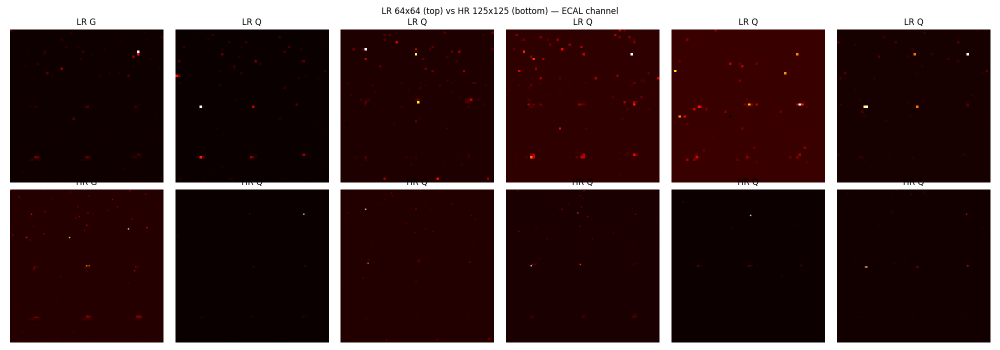
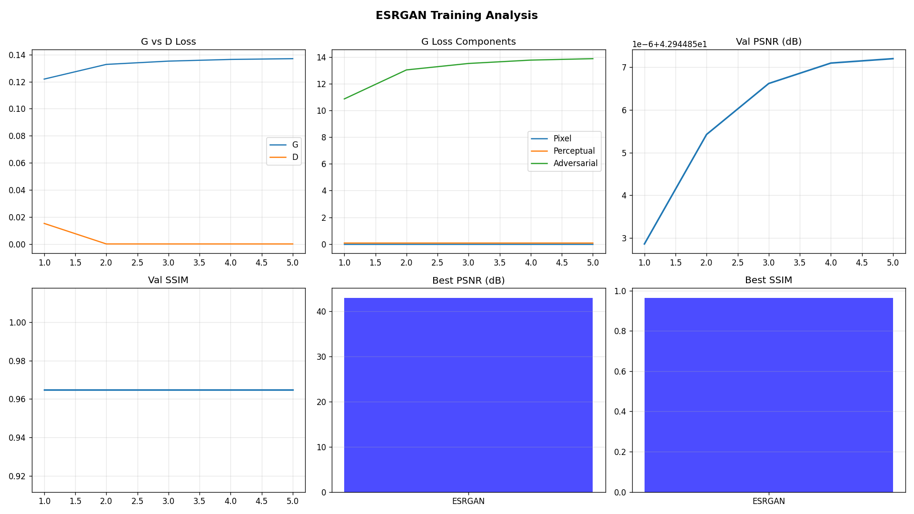
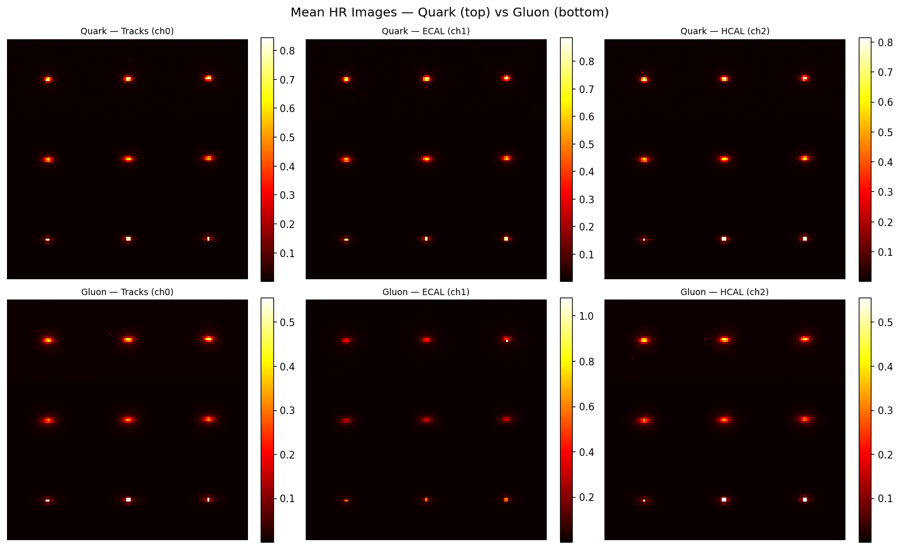

# Super-Resolution at the CMS Detector

## Table of Contents
1. [Project Overview](#project-overview)
2. [Dataset](#dataset)
3. [My Approach: ESRGAN](#my-approach-esrgan)
4. [Architecture Deep Dive](#architecture-deep-dive)
5. [Training Strategy & Limitations](#training-strategy--limitations)
6. [Results](#results)
7. [Alternative Approaches & Future Work](#alternative-approaches--future-work)
8. [Quick Start](#quick-start)

---

## Project Overview

This project applies **Generative Adversarial Network (GAN)**-based super-resolution to particle physics data from the **CMS detector** at CERN's Large Hadron Collider (LHC). The goal is to train a machine learning model to take a **low-resolution (64×64)** calorimeter jet image and reconstruct the corresponding **high-resolution (125×125)** image — recovering the fine-grained energy deposits that are lost in the low-resolution representation.

| Task | Description |
|------|-------------|
| **Input** | 64×64 three-channel jet image (LR) |
| **Output** | 125×125 three-channel jet image (SR) |
| **Ground Truth** | 125×125 simulated high-resolution image (HR) |
| **Model** | ESRGAN (Enhanced Super-Resolution GAN) |

---

## Dataset

The dataset contains 125×125 matrices of low (LR 64×64) and high (HR 125×125) resolution in three-channel images for two classes of particles, quarks and gluons, impinging on a calorimeter.

| Property | Value |
|----------|-------|
| Events used | 5,000 |
| HR image shape | (125, 125, 3) |
| LR image shape | (64, 64, 3) |
| Upscale factor | ~1.95x |

### LR vs HR Visualization

The images below show low-resolution (64×64, top row) versus high-resolution (125×125, bottom row) jet images in the ECAL channel. G = Gluon jet, Q = Quark jet.



---

## My Approach: ESRGAN

I implemented **ESRGAN (Enhanced Super-Resolution GAN)**, a super-resolution model originally developed for natural images, adapted here for **sparse physics detector data**.

### Architecture Deep Dive

#### Generator: RRDB-Net

```
Input (3, 64, 64)
    ↓
[Head Conv] → 64 feature maps
    ↓
[6 × RRDB Blocks] ← No BatchNorm!
    ↓
[Body Conv + Residual Skip]
    ↓
[Pixel Shuffle ×2] → 128×128
    ↓
[Crop to 125×125]
    ↓
[Tail Conv + Sigmoid] → (3, 125, 125)
```

**Each RRDB block contains:**
- 3 Dense Blocks, each with 5 convolutional layers
- LeakyReLU activations (slope=0.2)
- Residual scaling (0.2) to prevent training instability

**Why No BatchNorm?**
BatchNorm normalises activations across a batch. For **sparse data** (where 98.4% of values are zero), BatchNorm would:
1. Shift non-zero (physically meaningful) activations toward zero
2. Destroy the sparse structure that carries physics information

This is why ESRGAN's "no BatchNorm" design is particularly well-suited here.

#### Discriminator
The discriminator is a VGG-style convolutional network:
- Strided convolutions to downsample
- BatchNorm (only in discriminator — on 125×125 dense feature maps, it's fine)
- Outputs a single logit (real vs. fake score)

---

## Training Strategy & Limitations

### Two-Phase Training
1. **Phase 1: Pixel Warmup (3 epochs)** - Train the generator only with pixel-wise L1 loss to establish good initial weights.
2. **Phase 2: Full ESRGAN Training (5 epochs)** - Fast adversarial training where the Generator uses a composite loss (Pixel L1, VGG Perceptual, and Relativistic GAN Loss) and the Discriminator uses Relativistic Average GAN (RaGAN) loss.

### Limitations
Due to limited compute power (training on Apple MPS without a dedicated GPU), I was restricted to using a small subset of the dataset (5,000 out of 36,272 available samples) and running fewer epochs (3 warmup + 5 GAN epochs). Full training on a dedicated GPU would allow for 30–50+ epochs on the complete dataset, which would further improve generalization and GAN convergence.

---

## Results

### Quantitative Metrics (on Test Set)

| Model | PSNR (dB) ↑ | SSIM ↑ |
|-------|------------|--------|
| **ESRGAN (My Approach)** | **43.05** | **0.9656** |

My ESRGAN model achieved a **PSNR of 43.05 dB** and an **SSIM of 0.9656**. PSNR (Peak Signal-to-Noise Ratio) measures pixel-level fidelity (higher is better), and 43.05 dB is an excellent reconstruction score for these sparse images. SSIM (Structural Similarity Index) measures structural perception from 0 to 1, and 0.9656 indicates a near-perfect structural match to the ground truth.

### Training Curves

The plots below show the training progression over the 5 adversarial epochs:



### Visual Comparison

From left to right: LR Input, ESRGAN SR output, HR Ground Truth, and |SR - HR| Residual.


### Mean Energy Distributions

The plot below shows the mean energy distribution for Quark (top) vs. Gluon (bottom) jets across all three channels. This demonstrates the structural patterns of the jets that the model is learning to reconstruct.



---

## Comparison with Related Papers & Future Work

While I utilized a GAN-based approach with ESRGAN, exploring the other methodologies highlighted in the challenge provides a solid roadmap for comparing my results and planning future improvements in super-resolving CMS detector data:

- **Conditional Diffusion Models (DiffLense):** The DiffLense paper applied conditional diffusion to gravitational lensing images, reaching a PSNR of 35.07 dB and an SSIM of 0.839. In comparison, my ESRGAN approach on calorimeter data achieved a **PSNR of 43.05 dB** and an **SSIM of 0.9656**. While my GAN achieved higher metrics on this specific dataset, adapting a conditional diffusion model (like a U-Net backbone) to calorimeter data could excel at preserving extremely fine structures and learning complex noise profiles.
- **Visual Autoregressive Modeling (VAR):** The VAR paper introduces a coarse-to-fine "next-scale prediction" approach for general image generation rather than standard pixel-by-pixel prediction. Implementing this next-scale prediction paradigm specifically for calorimeter jet super-resolution naturally fits the progressive upscaling required, creating a highly effective domain-specific SR alternative to my GAN. 
- **Latent-Space Predictions (V-JEPA 2):** V-JEPA 2 focuses on self-supervised latent-space predictions rather than raw pixel reconstruction. By predicting super-resolution directly in a compressed latent space where abstract physics features are explicitly encoded, a JEPA-based approach could learn the underlying physics better and guide the super-resolution process more effectively than standard pixel-space reconstruction.

**Other direct improvements for my current approach:**
- Utilizing full GPU training to enable 50+ epochs on all available samples.
- Developing a physics-aware perceptual loss instead of using standard natural-image VGG features.

---

## Quick Start

```bash
# Open the Jupyter notebook
jupyter notebook CMS_SuperResolution_GAN.ipynb
```

**Note on Dataset:**
Please make sure to **change the dataset path** in the notebook if you want to run it for your setup! I have only used 1 parquet file (`QCDToGGQQ_IMGjet_RH1all_jet0_run0_n36272_LR.parquet`) for my training due to hardware limits.
